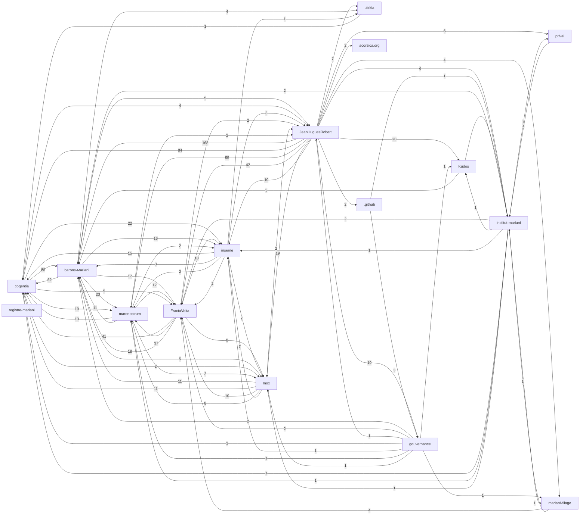

# Corpus Status — Inox

*Auto-refreshed by `cogentia.js corpus-status`. The structural sections* —
*Registered Repositories, Cross-Reference Graph, Published, What Remains Possible* —
*are regenerated from the registry and from [`research/index.md`](index.md) on every run.*
*The substantive sections* — *What Is Proved* *and* *Open Objections* —
*are manually curated and preserved across refreshes.*

---

## Registered Repositories
<!-- BEGIN_AUTO: registered_repos -->
| Repository | research/index.md | Branch | Policy | Visibility | Public presence |
|---|---|---|---|---|---|
| cogentia | yes | main | all | public | full |
| FractaVolta | yes | main | all | public | full |
| marenostrum | yes | main | all | public | full |
| barons-Mariani | yes | main | all | public | full |
| inseme | yes | main | research | public | full |
| Inox | yes | master | all | public | full |
| registre-mariani | yes | main | all | private | stub |
| ubikia | yes | main | all | public | full |
| JeanHuguesRobert | yes | main | all | public | full |
| privai | yes | main | all | public | full |
| gouvernance | yes | main | all | public | full |
| marianivillage | yes | main | all | public | full |
| institut-mariani | yes | main | all | public | full |
| Kudos | yes | main | all | public | full |
| .github | yes | main | all | public | full |
| acorsica.org | yes | main | all | public | full |
<!-- END_AUTO: registered_repos -->
---

## Cross-Reference Graph
<!-- BEGIN_AUTO: graph -->

<!-- END_AUTO: graph -->
---

## Published in this repo
<!-- BEGIN_AUTO: published -->
| Title | Location | Date |
|---|---|---|
| [The Inox Programming Language — Specification](inox-spec.md) *(language reference, control structures, named values, dialects, actors, design notes)* | this repo | 2021-06 → |
| [Lien avec C.O.R.S.I.C.A. et l’Institut Mariani](acorsica-institut-mariani.md) *(institutional boundary note — Inox, C.O.R.S.I.C.A. and Institut Mariani)* | this repo | 2026-06-03 |
| [Test du critère Rossignol — Inox (FR)](test_critere_rossignol_inox.md) *(working-note v0.1, 2026-05-31 — Inox au crible du critère « pas de stabilisateur sans Rossignol » ; hiérarchie 7 étages ; frontière courante = étage 5→6)* | this repo | 2026-05-31 |
| [Reactive Sets in Inox — Native Implementation Path](reactive_sets_inox_cop_implementation.md) *(Toubkal/COP/Cogentia implementation path for native reactive sets, queries, attractors and pressure strategies)* | this repo | 2026-06-01 |
| [JS Interop API for the "Inox for scripts" layer](js-interop-api-for-scripting-layer.md) *(working API note — explicit bridge to the underlying JavaScript VM for scripting and agent extension)* | this repo | 2026-06-05 |
| [Inox: Two Versions — Scripting vs System Programming](two-versions-scripting-vs-system.md) *(source design note — scripting layer obvious for agents; system layer for l9 + COP complexity)* | this repo | 2026-06-05 |
| [Inox Documentation Index](inox-docs-index.md) *(working index v0.1 — documentation map for current Inox learning and design notes)* | this repo | 2026-06-02 |
| [Basic Inox Tutorial](inox-tutorial-basic.md) *(working tutorial v0.1)* | this repo | 2026-06-02 |
| [Inox Naming and the Absence of Assignment](inox-naming-and-assignment.md) *(working note v0.1)* | this repo | 2026-06-02 |
| [Inox Tutorial Generation Guidelines](inox-tutorial-generation-guidelines.md) *(working note v0.1)* | this repo | 2026-06-02 |
| [Learning Inox — A tutorial for AI agents (and humans in a hurry)](learning-inox.md) *(working-paper tutorial — sections marked ⚠️ need author review)* | this repo | 2026-05-22 |
| [Library packets — when the library is a specification, not code](library_packets.md) *(working hypothesis — LLM-generation as defensive heterogeneity against supply-chain attacks and as a substrate-specific packet pattern)* | this repo | 2026-05-23 |
| [Inox naming conventions and design influences](naming-conventions.md) *(working notes)* | this repo | 2026-05-22 |
| [Inox token-efficiency for LLMs — open hypothesis](llm_token_efficiency.md) *(working hypothesis — does concatenative composition + named values + multi-dialect dispatch align Inox with autoregressive code generation? Living note accumulating evidence over time)* | this repo | 2026-05-23 |
| [AGENTS.md — Inox agent mandate](../AGENTS.md) *(local operational mandate for AI agents working in this repository)* | this repo | 2026-06-13 |
| [Corpus Status](corpus-status.md) *(living view — auto-refreshed by `cogentia.js corpus-status`)* | this repo | refreshable |
| [Concept Index](concepts.md) *(typed concept registry — mapped by `cogentia.js concepts`)* | this repo | refreshable |
<!-- END_AUTO: published -->
---

## Concept Status
<!-- BEGIN_AUTO: concepts -->
| Concept | Scope | Status | Type |
|---|---|---|---|
| [Concatenative language](./concepts.md#concatenative-language) | Global | Canonical | language paradigm |
| [Stack VM](./concepts.md#stack-vm) | Global | Operational | runtime architecture |
| [Control/data plane separation](./concepts.md#control-data-plane-separation) | Global | Canonical | architectural principle |
| [Named values](./concepts.md#named-values) | Global | Defined | language primitive |
| [Reactive sets](./concepts.md#reactive-sets) | Global | Seed | distributed primitive |
| [Actors](./concepts.md#actors) | Global | Working | concurrency model |
| [Dialects](./concepts.md#dialects) | Global | Defined | language facility |
| [Fractanet](./concepts.md#fractanet) | Global | Seed | distributed system |
<!-- END_AUTO: concepts -->
---

## What Is Proved

*Manually curated: claims demonstrated by the published work in this corpus.*

| Claim | Status | Evidence |
|---|---|---|
| _(add claims here)_ | | |

---

## Open Objections

*Manually curated: objections received publicly, not yet fully resolved.*

| Objection | Source | Status |
|---|---|---|
| _(add objections here)_ | | |

---

## What Remains Possible
<!-- BEGIN_AUTO: possibilities -->
- Bare-metal port to ESP32 and similar microcontrollers
- Inox as the implementation language of a future `cop-core` (currently TypeScript)
- Inox dialect for cognitive packets (continuation-as-language-primitive)
- Reactive-set primitives as the basis for a distributed dataflow Fractanet runtime
- Native Packet Attractors for routing without fixed addresses
- Pressure strategies (`best-effort`, `ttl`, `bounded`, `demand`, `durable`) as runtime policies
- [Research Index — barons-Mariani](https://github.com/JeanHuguesRobert/barons-Mariani/blob/main/research/index.md)
- [Research Index — Cogentia](https://github.com/JeanHuguesRobert/cogentia/blob/main/research/index.md)
- [Research Index — FractaVolta](https://github.com/JeanHuguesRobert/FractaVolta/blob/main/research/index.md)
- [Corpus Status — Inox](corpus-status.md)
- [Reactive Sets in Inox — Native Implementation Path](reactive_sets_inox_cop_implementation.md)
- [The Iɴᴏx programming language](../README.md)
- [Research Index — Inseme](https://github.com/JeanHuguesRobert/inseme/blob/main/research/index.md)
- [Research Index — Jean Hugues Noël Robert (Profile / Entry Point)](https://github.com/JeanHuguesRobert/JeanHuguesRobert/blob/main/research/index.md)
- [Research Index — MareNostrum](https://github.com/JeanHuguesRobert/marenostrum/blob/main/research/index.md)
<!-- END_AUTO: possibilities -->
---

*Generated with `cogentia.js corpus-status` — [scripts/cogentia.js](https://github.com/JeanHuguesRobert/cogentia/blob/main/scripts/cogentia.js)*
*Challenge via issues. Fork to explore alternatives.*
<!-- BEGIN_AUTO: backlinks -->
### Backlinks

*These documents link to this file:*
- [Research Index — Inox](index.md)
- [The Iɴᴏx programming language](../README.md)
<!-- END_AUTO: backlinks -->
