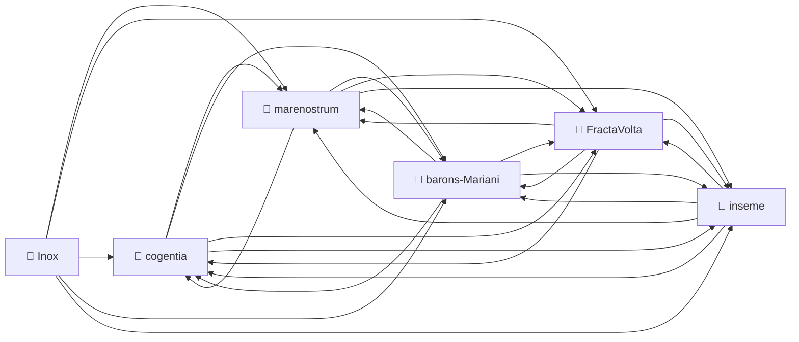

# Corpus Status — Inox

*Auto-refreshed by `cogentia.js corpus-status`. The structural sections* —
*Registered Repositories, Cross-Reference Graph, Published, What Remains Possible* —
*are regenerated from the registry and from `research/index.md` on every run.*
*The substantive sections* — *What Is Proved* *and* *Open Objections* —
*are manually curated and preserved across refreshes.*

---

## Registered Repositories

<!-- BEGIN_AUTO: registered_repos -->
| Repository | research/index.md | Branch | Last commit |
|---|---|---|---|
| cogentia | ✅ | main | 2026-05-23 |
| FractaVolta | ✅ | main | 2026-05-23 |
| marenostrum | ✅ | main | 2026-05-23 |
| barons-Mariani | ✅ | main | 2026-05-23 |
| inseme | ✅ | main | 2026-05-23 |
| Inox | ✅ | master | 2026-05-23 |
<!-- END_AUTO: registered_repos -->

---

## Cross-Reference Graph

<!-- BEGIN_AUTO: graph -->

<!-- END_AUTO: graph -->

---

## Published in this repo

<!-- BEGIN_AUTO: published -->
| Title | Location | Date |
|---|---|---|
| [The Inox Programming Language — Specification](inox-spec.md) *(language reference, control structures, named values, dialects, actors, design notes)* | this repo | 2021-06 → |
| [Corpus Status](corpus-status.md) *(living view — auto-refreshed by `cogentia.js corpus-status`)* | this repo | refreshable |
| [Concept Index](concepts.md) *(typed concept registry — mapped by `cogentia.js concepts`)* | this repo | refreshable |
<!-- END_AUTO: published -->

---

## Concept Status

<!-- BEGIN_AUTO: concepts -->
| Concept | Scope | Status | Type |
|---|---|---|---|
| [Concatenative language](./concepts.md#concatenative-language) | Global | Canonical | language paradigm |
| [Stack VM](./concepts.md#stack-vm) | Global | Operational | runtime architecture |
| [Control/data plane separation](./concepts.md#controldata-plane-separation) | Global | Canonical | architectural principle |
| [Named values](./concepts.md#named-values) | Global | Defined | language primitive |
| [Reactive sets](./concepts.md#reactive-sets) | Global | Seed | distributed primitive |
| [Actors](./concepts.md#actors) | Global | Working | concurrency model |
| [Dialects](./concepts.md#dialects) | Global | Defined | language facility |
| [Fractanet](./concepts.md#fractanet) | Global | Seed | distributed system |
<!-- END_AUTO: concepts -->

---

## What Is Proved

*Manually curated: claims demonstrated by the published work in this corpus.*

| Claim | Status | Evidence |
|---|---|---|
| _(add claims here)_ | | |

---

## Open Objections

*Manually curated: objections received publicly, not yet fully resolved.*

| Objection | Source | Status |
|---|---|---|
| _(add objections here)_ | | |

---

## What Remains Possible

<!-- BEGIN_AUTO: possibilities -->
- Bare-metal port to ESP32 and similar microcontrollers
- Inox as the implementation language of a future `cop-core` (currently TypeScript)
- Inox dialect for cognitive packets (continuation-as-language-primitive)
- Reactive-set primitives as the basis for a distributed dataflow Fractanet runtime
<!-- END_AUTO: possibilities -->

---

*Generated with `cogentia.js corpus-status` — [scripts/cogentia.js](https://github.com/JeanHuguesRobert/cogentia/blob/main/scripts/cogentia.js)*
*Challenge via issues. Fork to explore alternatives.*

<!-- BEGIN_AUTO: backlinks -->
### Backlinks

*These documents link to this file:*
- [Concept Index — Inox](concepts.md)
- [Corpus Status — Inox](corpus-status.md)
- [Research Index — Inox](index.md)
- [The Inox Programming Language — Specification](inox-spec.md)

<!-- END_AUTO: backlinks -->
